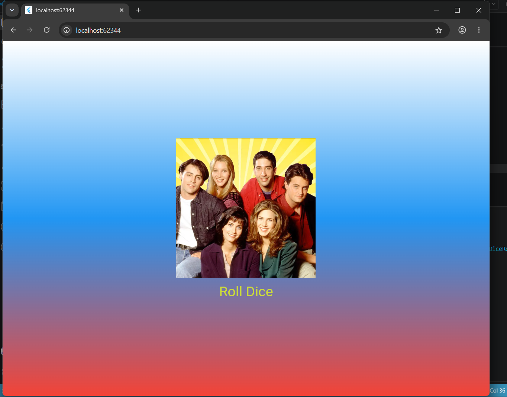

# Лабораторная работа №4-5. Flutter: структура UI и компонентный подход

Фамилия: Шевченко 
Имя: Вероника  
Группа: ИСП-242  
Дата сдачи: 08.10.2026  

---

## Что изучили

1. Научились разбивать интерфейс на отдельные виджеты и выносить их в отдельные файлы для переиспользования.
2. Научились подключать изображения в проект через 'pubspec.yaml' и отображать их с помощью 'Image.asset'.
3. Разобрались, чем отличается 'StatelessWidget' от 'StatefulWidget', и научились использовать 'setState()' для перерисовки экрана при изменении данных.
4. Научились создавать кнопки, стилизовать их через 'TextButton.styleFrom' и обрабатывать нажатия.
5. Научились использовать класс 'Random' из библиотеки 'dart:math' для случайного выбора грани кубика.

---

## Скриншот финального приложения

---

## Ссылка на репозиторий

[Flutter_Lab4](https://github.com/myriton/Flutter_Lab4.git)

---

## Инструкция по запуску

1. Убедитесь, что у вас установлен Flutter SDK и Google Chrome.
2. Клонируйте репозиторий: git clone https://github.com/myriton/Flutter_Lab4.git
3. Перейтдите в папку:  cd Flutter_Widgets
4. Запустите приложение в Chrome: flutter run -d chrome

---

## Ответы на вопросы

1. Вынос виджетов в отдельные файлы нужен для:
    - Читаемости — код проще ориентировать, когда каждый виджет в своём файле.
    - Переиспользования — виджет можно импортировать в разные части приложения.
    - Командной работы — несколько разработчиков могут работать параллельно.
Если держать всё в main.dart, код превратится в одну большую «простыню», которую сложно читать, поддерживать и тестировать. Приложение будет работать, но развитие проекта замедлится.
2. 
- BuildContext — это объект, который содержит информацию о положении виджета в дереве виджетов. Он позволяет виджету получать доступ к данным из родительских виджетов.
- Метод build() принимает его, потому что Flutter передаёт контекст автоматически при каждой перерисовке. Без него виджет не сможет корректно встроиться в дерево.
3. 
- StatelessWidget — это виджет без состояния. Он отрисовывается один раз и не меняется. Подходит для статичного UI. Пример: GradientContainer — градиентный фон, который не меняется.StatelessWidget: GradientContainer — градиентный фон, который не меняется.
- StatefulWidget — это виджет с состоянием. Он может меняться по действию пользователя. Состояние хранится в объекте State, и при его изменении вызывается setState(), что приводит к перерисовке. Пример: DiceRoller — виджет, который меняет картинку кубика при нажатии на кнопку. StatefulWidget: DiceRoller — виджет, который меняет картинку кубика при нажатии кнопки.
4. Если создавать Random() внутри rollDice(), то при каждом нажатии кнопки будет создаваться новый генератор случайных чисел. Это менее эффективно.
Создание одного объекта Random на уровне файла позволяет использовать его повторно.